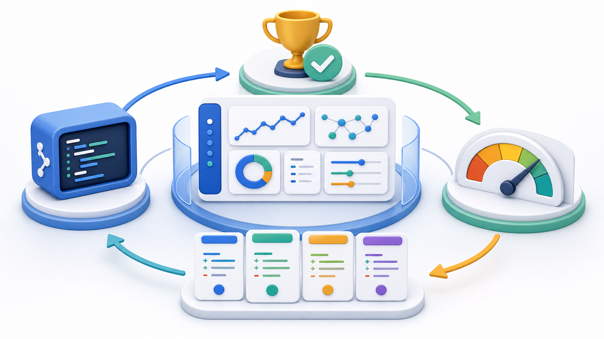
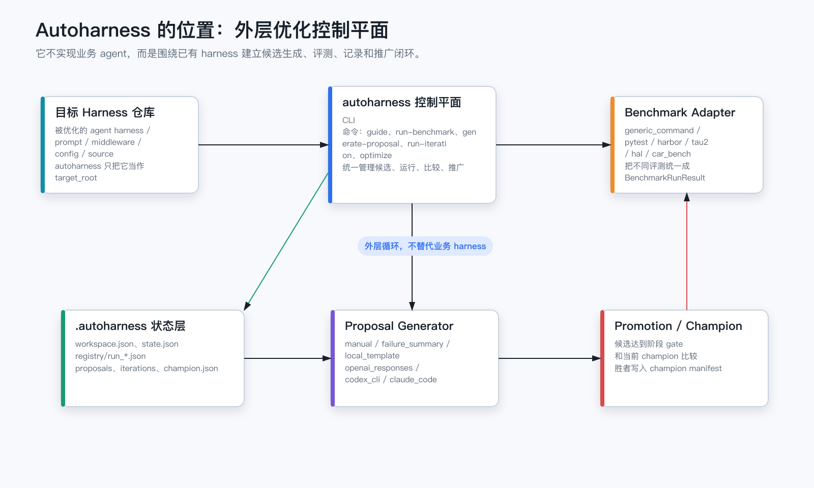
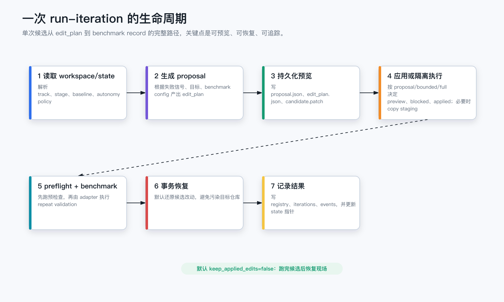
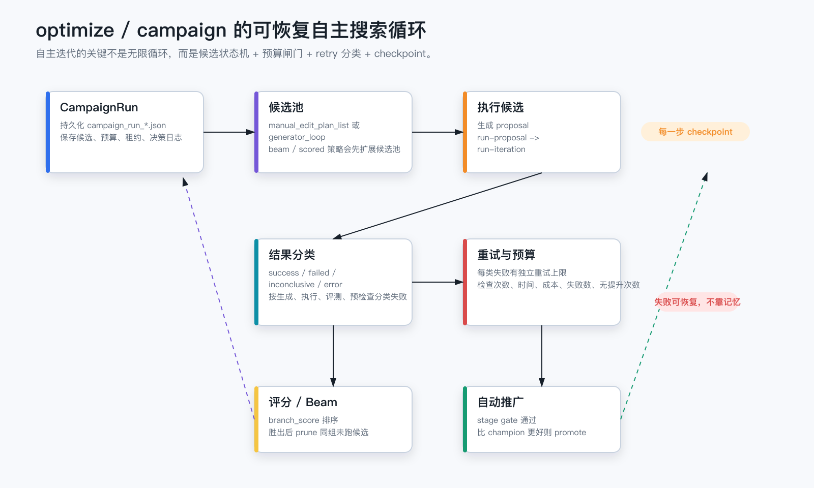
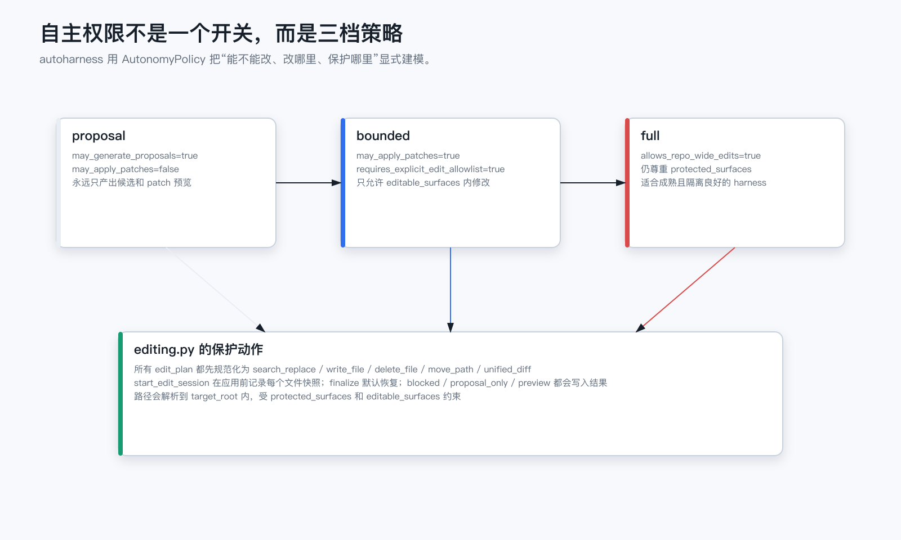
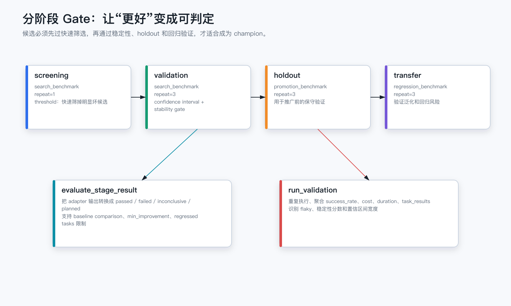
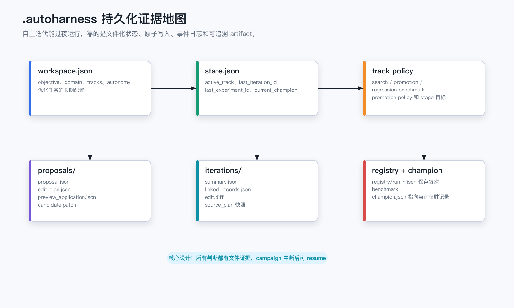
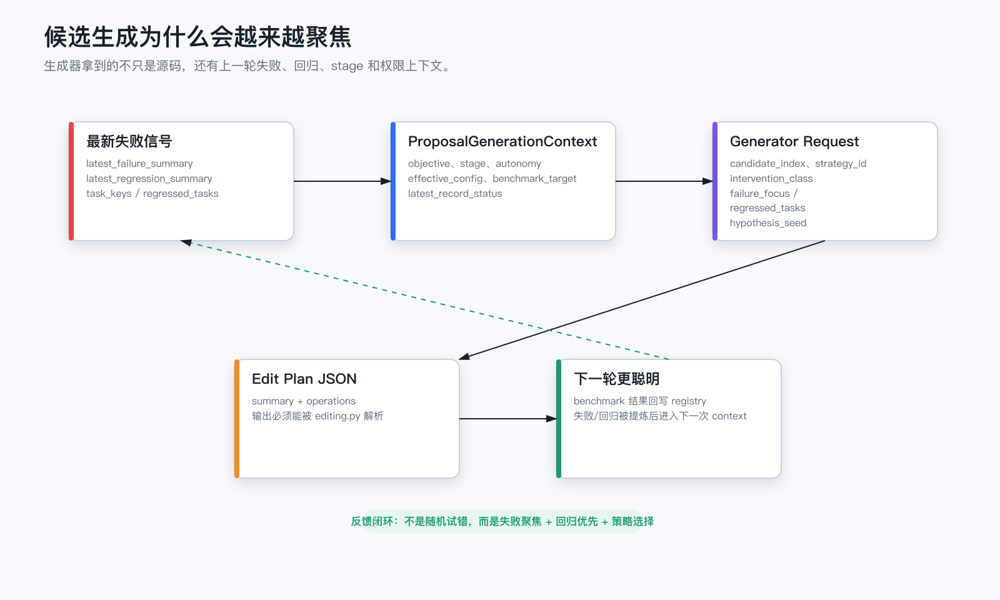

# Autoharness 自主迭代实现学习笔记

来源仓库：[kayba-ai/autoharness](https://github.com/kayba-ai/autoharness/tree/main)，本次阅读的本地浅克隆 commit 为 `7cfd52e`。

## 教学图片

0. 
1. 
2. 
3. 
4. 
5. 
6. 
7. 

其中 `00-autoharness-cover.png` 是用 `imagegen` 生成的无文字教学封面；`01` 到 `07` 是源码教学用的确定性 SVG/PNG 流程图，由 `generate-diagrams.mjs` 生成，避免模型图片在中文标签上出现错字。

## 延伸方案

- [通过 Codex + Autoharness 评测 Skill 的详细方案](skill-eval-with-autoharness-plan.md)

## 一句话模型

Autoharness 不是业务 agent，也不是单纯的 benchmark runner。它是放在目标 harness 外面的优化控制平面：生成候选改动，受控应用或预览，运行评测，记录结果，再根据阶段 gate、champion 比较、预算和 retry 策略决定下一步。

## 自主迭代的主链路

核心链路可以理解为：

```text
guide/init
  -> workspace/state/track policy
  -> generate-proposal
  -> proposal artifact
  -> run-proposal/run-iteration
  -> benchmark record
  -> stage evaluation
  -> campaign decision
  -> promote champion or continue searching
```

对应源码入口：

- `src/autoharness/autonomy.py`：定义 `proposal`、`bounded`、`full` 三种自主权限模式。
- `src/autoharness/editing.py`：解析并事务化应用 `edit_plan`，默认在 iteration 结束后恢复现场。
- `src/autoharness/proposal_context.py`：把目标、配置、上一轮失败、回归、champion 等信息打包给 generator。
- `src/autoharness/generators/`：不同候选生成器，包括本地模板、OpenAI Responses、Codex CLI、Claude Code。
- `src/autoharness/execution_handlers.py`：`run-benchmark` 和 `run-iteration` 的实际执行逻辑。
- `src/autoharness/campaign_handlers.py`：`optimize`/campaign 的外层可恢复搜索循环。
- `src/autoharness/stages.py`：screening、validation、holdout、transfer 的阶段 gate。
- `src/autoharness/tracking.py`：benchmark record、iteration、promotion、champion 的文件化存储。

## 源码证据索引

- `autonomy.py` 的 `AutonomyPolicy` 把权限拆成 `may_apply_patches`、`requires_explicit_edit_allowlist`、`allows_repo_wide_edits`、`editable_surfaces`、`protected_surfaces`；`policy_for_mode()` 决定三档模式的默认行为。
- `editing.py` 的 `EditPlan` 只接受 `search_replace`、`write_file`、`delete_file`、`move_path`、`unified_diff` 五类操作；`start_edit_session()` 会解析 target root 内路径、检查 editable/protected surface，并返回 `applied`、`preview`、`proposal_only` 或 `blocked`。
- `editing.py` 的 `EditSession.finalize()` 是“实验不污染仓库”的关键：默认恢复应用前快照，只有 `keep_applied=True` 才保留。
- `proposal_handlers.py` 的 `_handle_generate_proposal()` 会构造 `ProposalGenerationContext` 和 `ProposalGenerationRequest`，调用 generator，随后用 preview-only edit session 生成 patch 和预览结果，再持久化 proposal artifact。
- `execution_handlers.py` 的 `_handle_run_iteration()` 会读取 proposal/edit plan、必要时创建 copy staging、执行 preflight、调用 `run_validation()`、评估 stage gate、写 benchmark record 和 iteration artifact，最后恢复 edit session。
- `campaign_handlers.py` 的 `_run_campaign_loop()` 是外层自主循环：它不断补候选池、选择候选、生成 proposal、运行 proposal、分类失败、按类别重试、计算 branch score、自动推广或因预算停止。
- `proposal_context.py` 会从最新 benchmark record 中提取 failing tasks 和 regressed tasks，让下一轮 generator 聚焦前一轮失败。
- `validation.py` 聚合多次 benchmark run，输出 success rate、Wilson interval、task result summary、stability summary 和 flaky 信号。
- `stages.py` 把 screening、validation、holdout、transfer 映射成不同 repeat count、benchmark policy key 和判定方式。
- `tracking.py` 把 workspace、state、proposal、iteration、registry record、promotion、champion 都落成文件，因此 campaign 可以 checkpoint 和 resume。

## 关键设计

### 1. 自主权限被显式建模

`AutonomyPolicy` 把“能不能改文件”拆成多个布尔权限和路径约束。`proposal` 只生成候选；`bounded` 只允许改白名单 surface；`full` 可以仓库级修改但仍保留 protected surface。这样自主并不等于失控，而是每一次改动都会被 policy 解释成 `applied`、`preview`、`proposal_only` 或 `blocked`。

### 2. 候选改动是结构化 edit_plan

候选不是让模型直接 shell 改仓库，而是生成结构化操作：`search_replace`、`write_file`、`delete_file`、`move_path`、`unified_diff`。`editing.py` 会先规范化、检查路径、记录快照，再决定是否应用。

### 3. 单次迭代默认不污染仓库

`run-iteration` 会在执行候选后调用 `edit_session.finalize(keep_applied=args.keep_applied_edits)`。默认 `keep_applied_edits=False`，所以候选改动用于评测后会恢复。真正保留要通过 promotion 路径，而不是每次试验都留在目标仓库里。

### 4. Benchmark 被 adapter 统一抽象

不同评测系统通过 adapter 转成统一的 `BenchmarkInvocation` 和 `BenchmarkRunResult`。因此 campaign 不关心底层是 `pytest`、通用命令、Tau2、HAL 还是 Harbor，它只消费统一的 success、metrics、task_results、cost、duration、artifact_sources。

### 5. 结果不是简单 pass/fail

`run_validation` 支持重复运行和聚合，计算 success rate、置信区间、flaky/stability 信号。`stages.py` 再把这些指标映射成阶段决策，并可和 baseline/champion 做比较。

### 6. Campaign 是可恢复状态机

`campaign_handlers.py` 在每个关键节点 checkpoint：候选开始、生成 proposal、执行、失败重试、完成、推广、停止。它还维护预算：最大 iteration、时间、token、benchmark cost、失败次数、无提升次数等。中断后可以通过持久化的 campaign_run 继续。

### 7. 下一轮生成会吃上一轮失败

`proposal_context.py` 会从最新 record 里提取失败任务和回归任务。搜索策略再决定是 failure-first、regression-first、round-robin、beam 还是 scoring。也就是说它的自主迭代不是随机试错，而是用上一轮评测结果收窄下一轮候选。

## 借鉴到自己的项目时要保留的骨架

- 明确目标仓库和控制平面的边界。
- 所有候选都先结构化成 edit plan。
- 每次实验都写 artifact，而不是只看终端输出。
- 默认恢复候选改动，只有推广路径才落地。
- 评测命令必须稳定、可重复，并能输出可解析指标。
- 长循环必须有预算、retry 分类、checkpoint 和 resume。
- 把失败任务提炼成下一轮 prompt/context，而不是只让模型“再试一次”。
